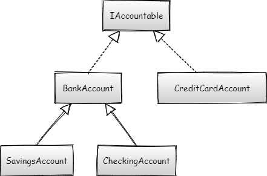

# Polymorphism

The purpose of this exercise is to practice writing code that uses the Object-Oriented Programming principle of polymorphism.

## Learning objectives

After completing this exercise, you'll be able to:

- Explain the concept of polymorphism and how it's useful
- Understand where inheritance can assist in writing polymorphic code
- State the purpose of interfaces and how they're used
- Use polymorphism through inheritance using IS-A relationships
- Use polymorphism through interfaces using CAN-DO relationships
- Give examples of interfaces from the C# standard library (Collections)

## Getting started

- Open the `BankTellerExercise.sln` solution in Visual Studio.
- Complete the appropriate classes to satisfy the requirements.

## Evaluation criteria and functional requirements

- The project must not have any build errors.
- Code is presented in a clean, organized format.
- Code is appropriately encapsulated.
- Polymorphism is used appropriately to avoid code duplication.
- The code meets the specifications defined below.

### Bank customer application

**Notes for all Classes and interfaces**
- X in the set column indicates it *must have a setter*.
- Private in the set column indicates it *must have a private setter*.
- Nothing in the set column indicates the attribute is readonly or derived. See the comments for that property for details.
- Readonly attributes don't require a setter. They're set from the class's constructor.

### Instructions

This code extends from the previous day's exercise. The bank account classes work well, but now the bank needs to calculate a customer's total assets to assign them VIP status if they have $25,000 or more in assets at the bank.

The bank is also introducing credit cards. Since credit cards aren't strictly bank accounts where money is stored, they don't inherit from the `BankAccount` class. However, they must still be accounted for in the VIP calculation.

For this exercise, you'll add new features to the code to create a `BankCustomer` class that has multiple accounts. You'll also create a new type of account: a credit card account. A credit card account isn't a `BankAccount`, but it needs to be stored with the customer as one of their accounts. To do this, you need to create a new interface that specifies that an object is "accountable" and has a `Balance` property.

For this exercise, you will:

1. Add a new method to allow customers to transfer money between `BankAccount`s.
2. Create a new interface called `IAccountable` and make `BankAccount` implement `IAccountable`.
3. Create a new class called `CreditCardAccount` that's also `IAccountable`.
4. Create a `BankCustomer` class that has many `IAccountable` objects and a calculated property, `IsVip`.

#### Step One: Add a new `TransferTo()` method to transfer money between `BankAccount`s

Add the following method to allow `BankAccount`s to transfer money to another `BankAccount`. Where would you add this method to make sure it works for all `BankAccount`s, including `SavingsAccount` and `CheckingAccount`?

| Method Name                                                  | Return Type | Description                                                  |
| ------------------------------------------------------------ | ----------- | ------------------------------------------------------------ |
| `TransferTo(BankAccount destinationAccount, decimal transferAmount)` | `decimal`   | Withdraws `transferAmount` from this account and deposits it into `destinationAccount`. Returns the balance of the "from" account (`this`). |

New unit tests have been added for this section. This section is complete when the `CheckingAccountTest`, `SavingsAccountTest`, and `BankAccountTest` unit tests pass.

#### Step Two: Create the `IAccountable` interface and make `BankAccount` implement it

The `IAccountable` interface means that an object can be used in the accounting process for the customer.

| Attribute Name | Data Type | Get  | Set  | Description                               |
| -------------- | --------- | ---- | ---- | ----------------------------------------- |
| `Balance`      | `decimal` | X    |      | Returns the balance value of the account. |

Add the `IAccountable` interface to `BankAccount`. This makes `BankAccount`, and all the classes that inherit from `BankAccount`, "accountable" classes.

Once the `IAccountableTests` unit tests pass, this section is complete.

#### Step Three: Implement a new `CreditCardAccount` class

A `CreditCardAccount` isn't a `BankAccount` but "can-do" `Accountable`.

| Constructor                                                         | Description                                                                                                            |
| ------------------------------------------------------------------- | ---------------------------------------------------------------------------------------------------------------------- |
| `CreditCardAccount(string accountHolderName, string accountNumber)` | A new credit card account requires an account holder name and account number. The debt defaults to a 0 dollar balance. |

| Attribute Name      | Data Type | Get  | Set     | Description                                                  |
| ------------------- | --------- | ---- | ------- | ------------------------------------------------------------ |
| `AccountHolderName` | `string`  | X    | private | Returns the account holder name that the account belongs to. |
| `AccountNumber`     | `string`  | X    |         | Readonly property returns the account number that the account belongs to. |
| `Debt`              | `decimal` | X    | private | Returns the amount the customer owes.                        |

| Method Name                      | Return Type | Description                                                  |
| -------------------------------- | ----------- | ------------------------------------------------------------ |
| `Pay(decimal amountToPay)`       | `decimal`   | Removes `amountToPay` from the amount owed and returns the new total amount owed. |
| `Charge(decimal amountToCharge)` | `decimal`   | Adds `amountToCharge` to the amount owed and returns the new total amount owed. |

Note: Be sure to implement the interface. The balance for the accounting must be the debt as a negative number.

Once the `CreditCardAccountTests` unit tests pass, this section is complete.

#### Step Four: Implement the `BankCustomer` class

Implement the `BankCustomer` class. A bank customer "has-a" list of `Accountable`s.

| Attribute Name | Data Type | Get  | Set  | Description                                                  |
| -------------- | --------- | ---- | ---- | ------------------------------------------------------------ |
| `Name`         | `string`  | X    | X    | Returns the name of the bank customer.                       |
| `Address`      | `string`  | X    | X    | Returns the address of the bank customer.                    |
| `PhoneNumber`  | `string`  | X    | X    | Returns the phone number of the bank customer.               |
| `IsVip`        | `bool`    | X    |      | Calculates the balance of all accounts, returns `true` if at least $25,000; otherwise is false. |

Note that you'll likely want to have a private variable or field to store the accounts inside of the class, but the name and data type for this is up to you to decide.

| Method Name                           | Return Type      | Description                                              |
| ------------------------------------- | ---------------- | -------------------------------------------------------- |
| `AddAccount(IAccountable newAccount)` | `void`           | Adds `newAccount` to the customer's list of accounts.    |
| `GetAccounts()`                       | `IAccountable[]` | Returns array of the accounts belonging to the customer. |

Note: Even though `GetAccounts()` returns an array, you don't have to store the accounts in the `BankCustomer` as an array. In fact, since you need to add accounts whenever the `AddAccount()` method is called, you'll need to use a different data structure in the class to store the accounts that's like an array, but can be added to at any time.

Once the `BankCustomerTests` unit test passes, this section is complete.
