# Server-Side APIs: Part 1 Tutorial (C#)

In this tutorial, you'll work on an application that uses Tech Elevator Locations as the data model. In this locations application, you'll create an API that allows others to get a list of locations, as well as the ability to add new ones.

## Step One: Create a new ASP.NET Core Web project in Visual Studio

When you launch Visual Studio, you can create a new project by going to **File > New > Project** or by clicking the "Create a new project" button on the start page.

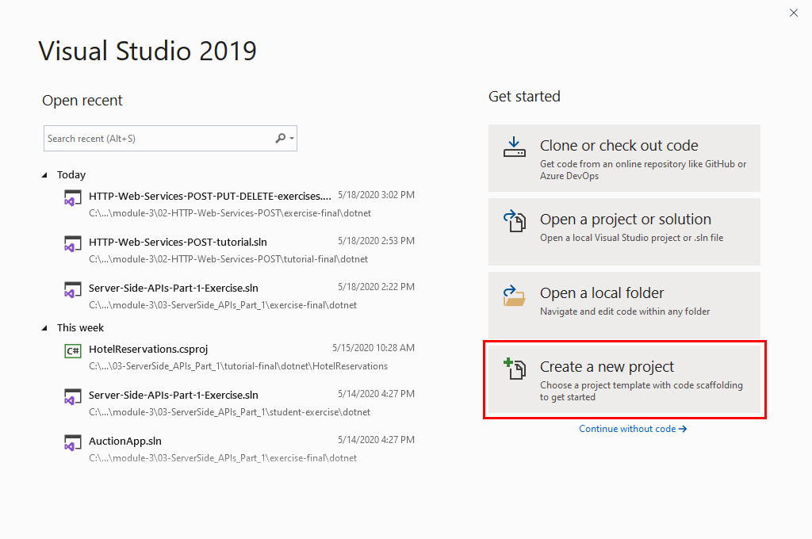

Next, select "ASP.NET Core Web Application" as your project type. If you can't find it, use the filters or the search box. Be sure to select the C# version. Click "Next" to go to the next screen.

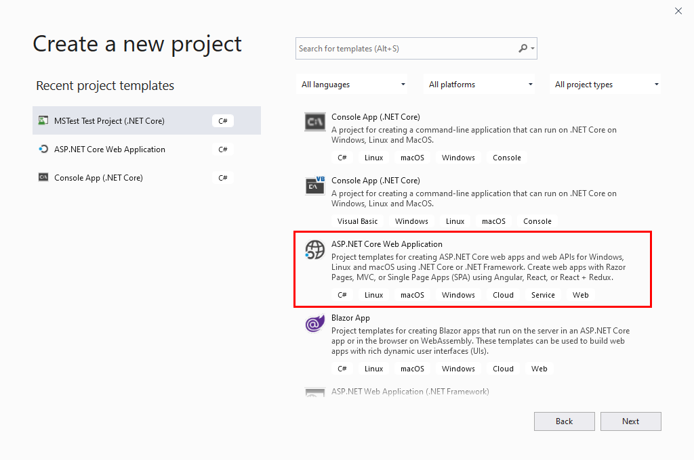

Enter "Locations" as the project name. Choose where you want to save the project.

> Note: Your location may not be the same as the screenshot.

The solution name automatically updates to match the project name. Click "Create" to go to the next screen.

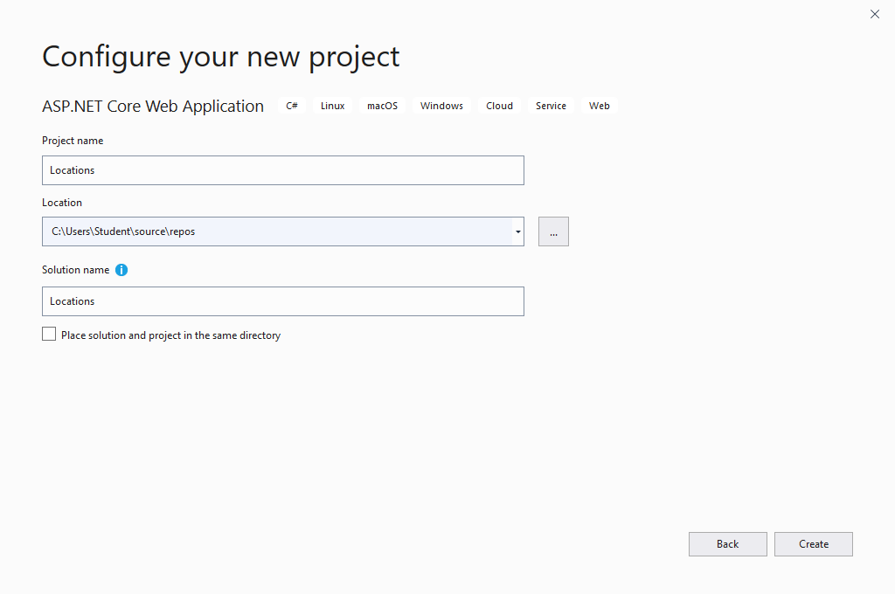

Lastly, select "API" as the project template, and make sure to select ".NET Core" and "ASP.NET Core 3.1" in the dropdown menus. If you don't select the correct values here, you may have some difficulty following along.

Leave "Configure for HTTPS" checked. Click "Create" to create the project.

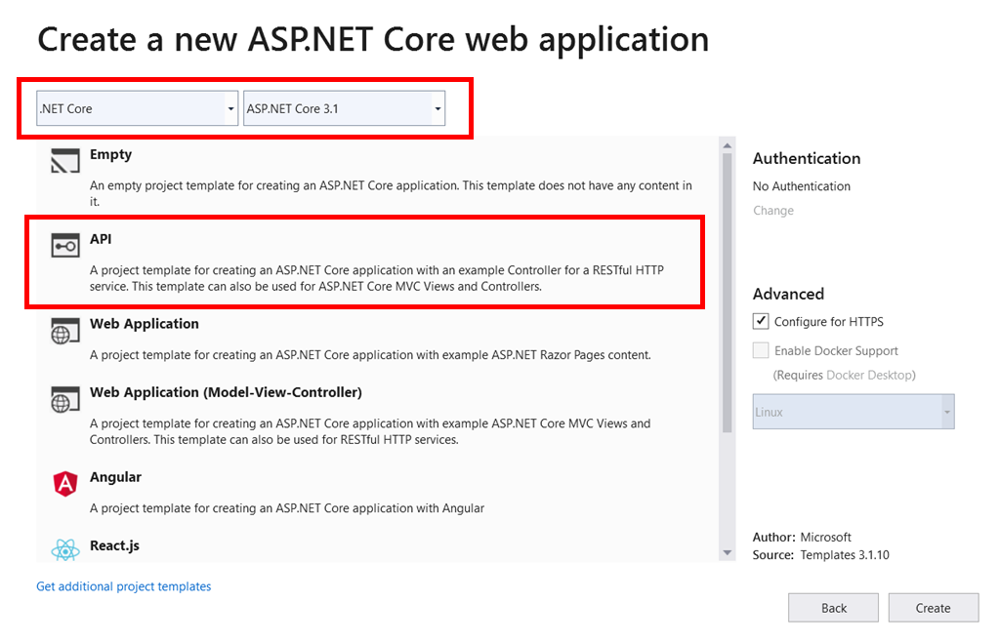

Now that you've set up your project in Visual Studio, run it to make sure everything works. It's best to make sure an application runs before adding anything new to it.

Next, go to the "Debug" menu and select "Start Debugging":

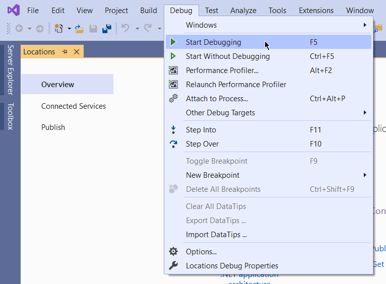

>Note: If you don't see "Start Debugging", you may need to open the "File" menu first, then open the "Debug" menu. Alternatively, you should have a button below the menus with a green triangle button next to it. It might read "IIS Express" or the name of your project. You can also click that to build and run your application.


The first time you run a web application configured with HTTPS on your computer, you have to tell the computer that you trust the IIS Express SSL certificate. You'll only have to do this once. You must answer "Yes" to the two windows that appear:

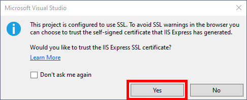

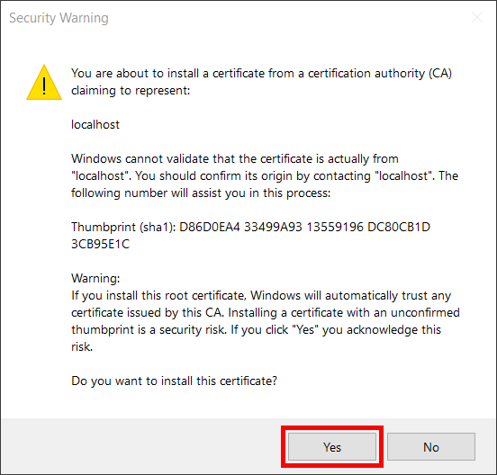

A browser window appears similar to the screenshot below.

>Note: Your port number may be different as Visual Studio generates a random port number upon project creation.


This is the result of the default controller that Visual Studio sets up for you. You'll delete this and set up your own in this tutorial.

Before proceeding, make sure to stop your application by clicking the stop button, though sometimes just closing the browser window is enough.


## Step Two: Create the `Locations` controller

Your application is running, and it returns data that resembles a weather forecast.

In your `Controllers` folder, you'll find `WeatherForecastController.cs`. This is the controller that returns the weather data. You can delete this file as the purpose of this tutorial is to show you how to create new controllers and action methods.

After you've deleted `WeatherForecastController.cs`, right-click on the `Controllers` folder, and select **Add > Controller**. In the window that appears, select "API Controller - Empty" and then click "Add":

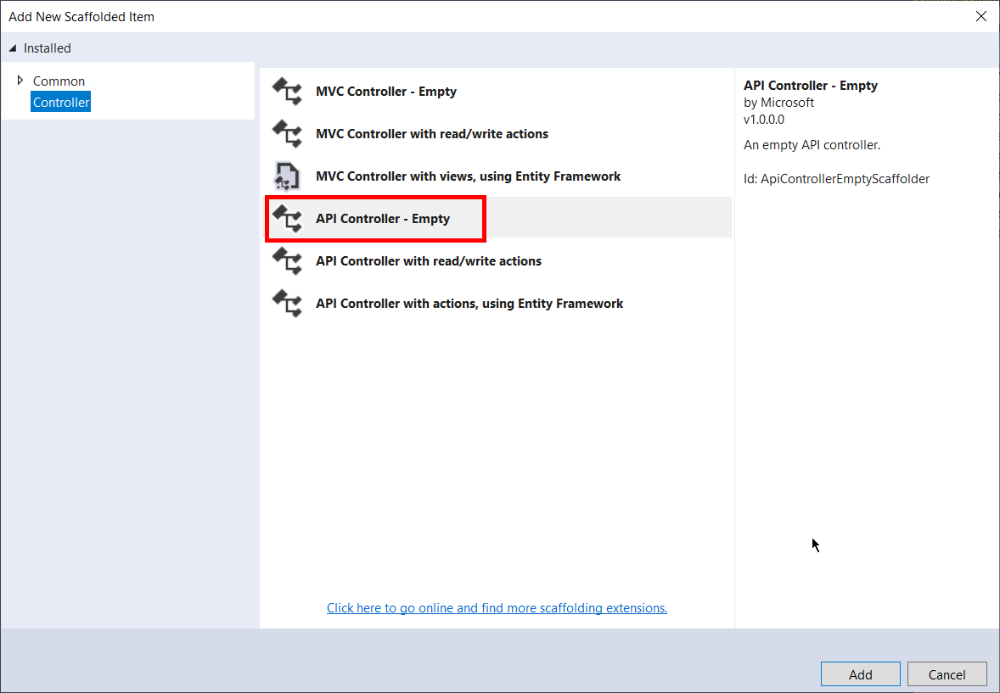

In the next window, make sure "API Controller Class - Empty" is still selected. Give the controller the name "LocationsController.cs" and then click "Add":

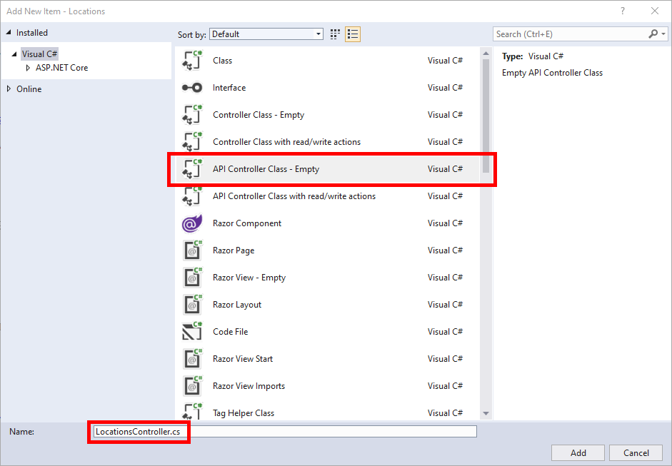

You'll end up with a file that looks like this:

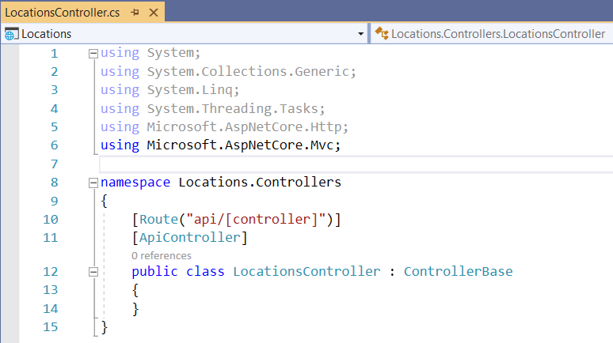

Notice how the class already has the `[Route]` and `[ApiController]` attributes, and that it inherits from `ControllerBase`.

Next, change the `[Route]` attribute so the controller responds to `/locations` instead of `/api/locations`:

```csharp
[Route("[controller]")]
```

You'll come back to this file shortly. Next, you need to create the model.

## Step Three: Create a `Location` model

Like most applications, you need data to make it interesting. This could come from many different places like a local file, a database, or even another API. In this tutorial, you'll store the data in a `List<>`.

In the previous command-line application, the `Location` model had the following properties:

- Id
- Name
- Address
- City
- State
- Zip

Now that you know what properties make up your model, you need to create one.

To get started, create a new folder in the project to store the models: right-click on the `Locations` project, and select **Add > New Folder**. Name the folder "Models." Like the "Controllers" folder, this naming convention is considered a best practice.

In the "Models" folder, create a new class called `Location.cs` and paste in the following code. You can replace the entire contents of the folder with the code below. Make sure the namespace matches the code below:

```csharp
namespace Locations
{
    public class Location
    {
        public int? Id { get; set; }
        public string Name { get; set; }
        public string Address { get; set; }
        public string City { get; set; }
        public string State { get; set; }
        public string Zip { get; set; }

        public Location() { }

        public Location(int? id, string name, string address, string city, string state, string zip)
        {
            Id = id;
            Name = name;
            Address = address;
            City = city;
            State = state;
            Zip = zip;
        }
    }
}
```

With your model in place, you can set up some initial data to expose in your API.

Back in `LocationsController.cs`, use the code below to create a `List` of `Location` objects:

```csharp
[Route("[controller]")]
[ApiController]
public class LocationsController : ControllerBase
{
    private static List<Location> locations = new List<Location>();

    public LocationsController()
    {
        if (locations.Count == 0)
        {
            locations.Add(new Location(1,
                    "Tech Elevator Cleveland",
                    "7100 Euclid Ave #14",
                    "Cleveland",
                    "OH",
                    "44103"));
            locations.Add(new Location(2,
                    "Tech Elevator Columbus",
                    "1275 Kinnear Rd #121",
                    "Columbus",
                    "OH",
                    "43212"));
            locations.Add(new Location(3,
                    "Tech Elevator Cincinnati",
                    "1776 Mentor Ave Suite 355",
                    "Cincinnati",
                    "OH",
                    "45212"));
            locations.Add(new Location(4,
                    "Tech Elevator Pittsburgh",
                    "901 Pennsylvania Ave #3",
                    "Pittsburgh",
                    "PA",
                    "15233"));
            locations.Add(new Location(5,
                    "Tech Elevator Detroit",
                    "440 Burroughs St #316",
                    "Detroit",
                    "MI",
                    "48202"));
            locations.Add(new Location(6,
                    "Tech Elevator Philadelphia",
                    "30 S 17th St",
                    "Philadelphia",
                    "PA",
                    "19103"));
        }
    }
}
```

## Step Four: Get a list of locations

Now you've set up a basic controller, a model that represents a location, and some initial data. The first method you'll expose in your API is a way to get a list of all the locations.

To do so, you'll set up an action method for the `/locations` route. This method returns the list of locations, and thanks to ASP.NET, it's converted to an array of JSON objects:

```csharp
[HttpGet]
public List<Location> List()
{
    return locations;
}
```

Run the application again using the "IIS Express" button or **Debug > Start Debugging** from the menu. A new browser window opens for `https://localhost:44349/weatherforecast`. Notice that this is the route for the old controller.

You can manually change the URL in the browser to `https://localhost:44349/locations`, but doing that each time you want to test is tedious. Luckily, there's a configuration file that contains the default URL that's launched each time you run the application.

Back in Visual Studio, in the Solution Explorer, expand the "Properties" section, and locate the `launchSettings.json` file and open it:

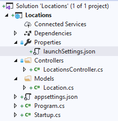

This file contains some configuration settings for your application, such as how it launches on your development machine:

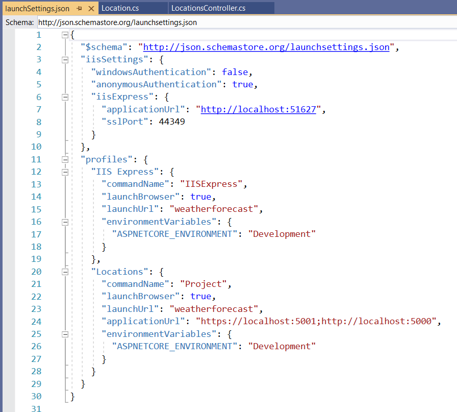

There are two lines that you need to change. They both contain this text:

```js
"launchUrl": "weatherforecast",
```

You need to change the lines to this:

```js
"launchUrl": "locations",
```

After saving the changes to `launchSettings.json`, relaunch your application using the "IIS Express" button  or **Debug > Start Debugging** from the menu. A browser window opens for `https://localhost:44349/locations`.

Since this is a `GET` request, you can also use Postman. Enter the same URL: `https://localhost:44349/locations`.

>Note: If you get the error "Could not get response", you may need to turn off "SSL certificate verification" in **File > Settings > General** (Windows) or **Postman > Preferences > General** (macOS):

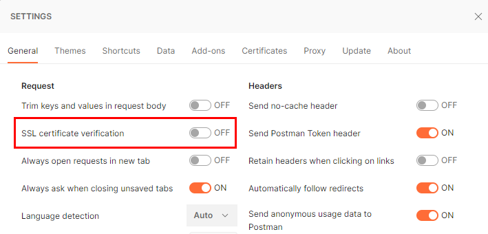

You'll get a list of locations in JSON format:

```js
[
    {
        "id": 1,
        "name": "Tech Elevator Cleveland",
        "address": "7100 Euclid Ave #14",
        "city": "Cleveland",
        "state": "OH",
        "zip": "44103"
    },
    {
        "id": 2,
        "name": "Tech Elevator Columbus",
        "address": "1275 Kinnear Rd #121",
        "city": "Columbus",
        "state": "OH",
        "zip": "43212"
    },
    {
        "id": 3,
        "name": "Tech Elevator Cincinnati",
        "address": "1776 Mentor Ave Suite 355",
        "city": "Cincinnati",
        "state": "OH",
        "zip": "45212"
    },
    {
        "id": 4,
        "name": "Tech Elevator Pittsburgh",
        "address": "901 Pennsylvania Ave #3",
        "city": "Pittsburgh",
        "state": "PA",
        "zip": "15233"
    },
    {
        "id": 5,
        "name": "Tech Elevator Detroit",
        "address": "440 Burroughs St #316",
        "city": "Detroit",
        "state": "MI",
        "zip": "48202"
    },
    {
        "id": 6,
        "name": "Tech Elevator Philadelphia",
        "address": "30 S 17th St",
        "city": "Philadelphia",
        "state": "PA",
        "zip": "19103"
    }
]
```

## Step Five: Add a location

You know how to get a list of the locations; now, you need to add a location. The path for this is still `/locations`, which is the same path as the previous one.

The only difference is that the request method accepts `POST` requests instead. This allows you to have the same path for similar resources, which are usually grouped within the same controller.

To define the method for `POST`, use the `[HttpPost]` attribute:

```csharp
[HttpPost]
public Location Add(Location location)
{
    if (location != null)
    {
        locations.Add(location);
        return location;
    }
    return null;
}
```

Unlike the `GET` example, you can't visit the `POST` `/locations` route in the browser. If you try to, the browser runs a `GET` operation and you're returned the list of locations.

You need to open Postman, and send a `POST` request to `/locations`. Make sure to set the `Content-Type` header to `application/json`, or set the body format to "raw" and "JSON."

In the body of the request, enter the following JSON content that sends a new location:

```js
{
	"id": 7,
	"name": "Tech Elevator Hawaii",
	"address": "1234 Kalia Rd",
	"city": "Honolulu",
	"state": "HI",
	"zip": "96815"
}
```

If you followed the instructions correctly, you'll see a status code of `200` after you hit "Send."

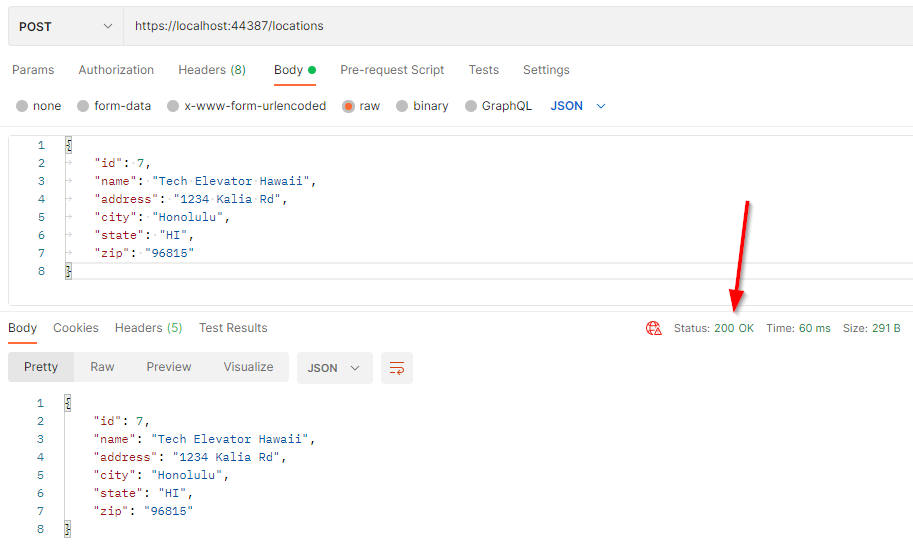

If you run another `GET` on `/locations`, you'll see your new location added to the list:

```js
[
    {
        "id": 1,
        "name": "Tech Elevator Cleveland",
        "address": "7100 Euclid Ave #14",
        "city": "Cleveland",
        "state": "OH",
        "zip": "44103"
    },
    {
        "id": 2,
        "name": "Tech Elevator Columbus",
        "address": "1275 Kinnear Rd #121",
        "city": "Columbus",
        "state": "OH",
        "zip": "43212"
    },
    {
        "id": 3,
        "name": "Tech Elevator Cincinnati",
        "address": "1776 Mentor Ave Suite 355",
        "city": "Cincinnati",
        "state": "OH",
        "zip": "45212"
    },
    {
        "id": 4,
        "name": "Tech Elevator Pittsburgh",
        "address": "901 Pennsylvania Ave #3",
        "city": "Pittsburgh",
        "state": "PA",
        "zip": "15233"
    },
    {
        "id": 5,
        "name": "Tech Elevator Detroit",
        "address": "440 Burroughs St #316",
        "city": "Detroit",
        "state": "MI",
        "zip": "48202"
    },
    {
        "id": 6,
        "name": "Tech Elevator Philadelphia",
        "address": "30 S 17th St",
        "city": "Philadelphia",
        "state": "PA",
        "zip": "19103"
    },
    {
        "id": 7,
        "name": "Tech Elevator Hawaii",
        "address": "1234 Kalia Rd",
        "city": "Honolulu",
        "state": "HI",
        "zip": "96815"
    }
]
```

## Step Six: Return a random location

Now, you need to create one additional route in your API:

- Random
  - path: `/locations/random` (hint: you need to pass a parameter to `[HttpGet]`)
  - return: a random `Location` from the list of locations

Try to work on the problem by yourself before you move on and see what the solution might look like.

## Solution

This is what your controller looks like when you've completed the tutorial:

```csharp
using System;
using System.Collections.Generic;
using System.Linq;
using System.Threading.Tasks;
using Microsoft.AspNetCore.Http;
using Microsoft.AspNetCore.Mvc;

namespace Locations.Controllers
{
    [Route("[controller]")]
    [ApiController]
    public class LocationsController : ControllerBase
    {
        private static List<Location> locations = new List<Location>();

        public LocationsController()
        {
            if (locations.Count == 0)
            {
                locations.Add(new Location(1,
                        "Tech Elevator Cleveland",
                        "7100 Euclid Ave #14",
                        "Cleveland",
                        "OH",
                        "44103"));
                locations.Add(new Location(2,
                        "Tech Elevator Columbus",
                        "1275 Kinnear Rd #121",
                        "Columbus",
                        "OH",
                        "43212"));
                locations.Add(new Location(3,
                        "Tech Elevator Cincinnati",
                        "1776 Mentor Ave Suite 355",
                        "Cincinnati",
                        "OH",
                        "45212"));
                locations.Add(new Location(4,
                        "Tech Elevator Pittsburgh",
                        "901 Pennsylvania Ave #3",
                        "Pittsburgh",
                        "PA",
                        "15233"));
                locations.Add(new Location(5,
                        "Tech Elevator Detroit",
                        "440 Burroughs St #316",
                        "Detroit",
                        "MI",
                        "48202"));
                locations.Add(new Location(6,
                        "Tech Elevator Philadelphia",
                        "30 S 17th St",
                        "Philadelphia",
                        "PA",
                        "19103"));
            }
        }

        [HttpGet]
        public List<Location> List()
        {
            return locations;
        }

        [HttpPost]
        public Location Add(Location location)
        {
            if (location != null)
            {
                locations.Add(location);
                return location;
            }
            return null;
        }

        [HttpGet("random")]
        public Location Random()
        {
            int randomNumber = new Random().Next(1, locations.Count); //returns a random number between 1 and the number of locations
            return locations[randomNumber];
        }
    }
}
```

## Summary

In this tutorial, you learned:

- How to create a new ASP.NET Core Web application using the Visual Studio
- How to create a REST Controller
- How to create action methods to respond to requests at different routes and with different HTTP methods
- How to test your API in Postman
